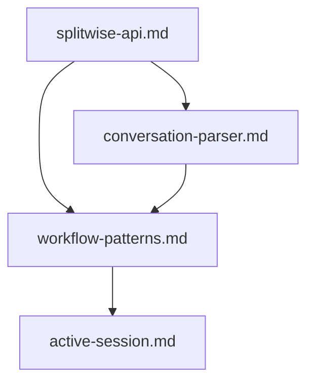
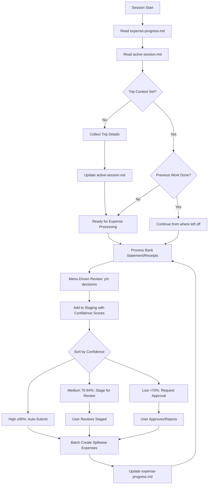

# Splitwise Integration Memory Bank

This directory contains essential knowledge for SPLITSMART to function as a conversational interface to Splitwise, designed to persist across sessions and overcome context window limitations.

## Architecture

Simple focused structure for Splitwise integration:



## Core Files

```
docs/memory_bank/
├── README.md              # This file - explains the memory bank system
├── expense-progress.md    # Dynamic: documents processed, expenses created, user decisions
├── active-session.md      # Static: trip context, group info, authentication status
├── splitwise-api.md       # Splitwise API endpoints, authentication, patterns
├── conversation-parser.md # Natural language → API parameter mapping
└── workflow-patterns.md   # Bank-statement-first processing workflows
```

## Memory Bank Lifecycle



## Usage

**Before any expense work:**
1. Read expense-progress.md to see what's been processed and decided
2. Read active-session.md for trip context and group setup
3. Read ALL other memory bank files for patterns and API info
4. Verify authentication and group context are set
5. Update expense-progress.md as work progresses

**File Responsibilities:**
- `expense-progress.md` = **Dynamic tracking** (gets updated constantly during session)
- `active-session.md` = **Static context** (set once, rarely changes during session)

**During expense entry:**
1. Parse natural language using conversation-parser.md patterns
2. Map to Splitwise API calls using splitwise-api.md
3. Update expense-progress.md with user decisions and created expenses

**During receipt processing:**
1. Use Read tool to extract text from uploaded PDF receipts
2. Parse vendor, date, total amount, and line items
3. Guide user through itemized splitting decisions
4. Create expense with detailed breakdown in notes field

**During bank statement processing:**
1. Extract transaction data from bank statement PDF/image
2. Filter transactions by trip dates and relevance
3. Present candidates for splitting, excluding ATM/personal charges
4. Batch create multiple Splitwise expenses efficiently

**During multi-receipt photo processing:**
1. Identify separate receipt regions within single photo
2. Extract details from each receipt individually
3. Allow selective splitting (some personal, some shared)
4. Process each shared receipt as separate expense

**Session management:**
1. Keep active-session.md current with group and member info
2. Write simple helper functions when needed
3. Handle API errors gracefully

## Key Commands

- `"follow your custom instructions"` - Read Memory Bank and start expense management
- `"set group [name]"` - Switch to different Splitwise group
- `"show balances"` - Fetch current balances from Splitwise
- `"add expense"` - Start conversational expense entry
- `"upload receipt"` - Process PDF receipt for expense creation
- `"upload bank statement"` - Process bank statement for multiple expenses
- `"upload photo"` - Process photo with multiple receipts

## Core Capabilities

- Natural language expense parsing
- PDF receipt processing and text extraction
- Bank statement transaction filtering and batch processing
- Multi-receipt photo analysis and individual processing
- Itemized expense splitting with line-item control
- Splitwise API integration with authentication
- Multiple splitting methods (equal, custom, proportional)
- Group member management and context tracking
- Error handling and user guidance
- Simple Python functions for API calls when needed