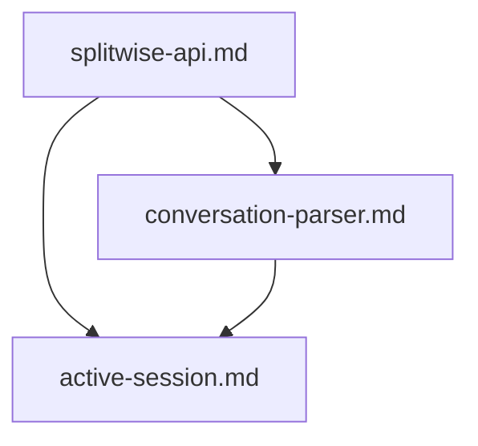
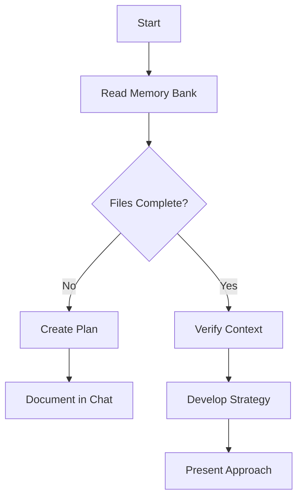

# Splitwise Integration Memory Bank

This directory contains essential knowledge for Claude to function as a conversational interface to Splitwise, designed to persist across sessions and overcome context window limitations.

## Architecture

Simple focused structure for Splitwise integration:



## Core Files

```
docs/memory_bank/
├── README.md              # This file - explains the memory bank system
├── splitwise-api.md       # Splitwise API endpoints, authentication, patterns
├── conversation-parser.md # Natural language → API parameter mapping
└── active-session.md      # Current group context and session state
```

## Memory Bank Lifecycle



## Usage

**Before any expense work:**
1. Read ALL memory bank files
2. Check authentication status in active-session.md
3. Verify group context is set

**During expense entry:**
1. Parse natural language using conversation-parser.md patterns
2. Map to Splitwise API calls using splitwise-api.md
3. Update active-session.md with new expenses

**Session management:**
1. Keep active-session.md current with group and member info
2. Write simple helper functions when needed
3. Handle API errors gracefully

## Key Commands

- `"follow your custom instructions"` - Read Memory Bank and start expense management
- `"set group [name]"` - Switch to different Splitwise group
- `"show balances"` - Fetch current balances from Splitwise
- `"add expense"` - Start conversational expense entry

## Core Capabilities

- Natural language expense parsing
- Splitwise API integration with authentication
- Multiple splitting methods (equal, custom, proportional)
- Group member management and context tracking
- Error handling and user guidance
- Simple Python functions for API calls when needed